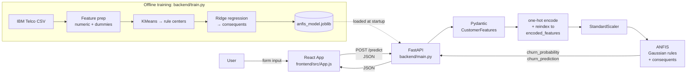

# Hybrid ANFIS Customer Churn Prediction

Full-stack telecom customer churn classifier built around a **Hybrid ANFIS** (Adaptive Neuro-Fuzzy Inference System) model. A FastAPI service exposes a `/predict` endpoint that returns a churn probability and a Yes/No label; a React single-page app drives it from a 13-field form.

Trained on the IBM Telco Customer Churn dataset (Cognos version, 7,043 rows). Achieves **ROC-AUC = 0.844** on the held-out test set.

## ANFIS in 3 lines

1. Each fuzzy rule fires with strength `w_r = exp(-0.5 · Σ((x − cᵣ) / σ)²)` — a Gaussian RBF on the standardized feature vector.
2. Per-sample firing strengths are L1-normalized so they sum to 1.
3. The churn probability is the normalized-firing-weighted sum of per-rule constant consequents, learned by ridge regression: `ŷ = w̃ · c`.

So it's a Takagi-Sugeno ANFIS with constant consequents, equivalent to a normalized RBF network where centers come from k-means and consequents are solved in closed form.

## Architecture



## Metrics

Reported on a stratified 20% held-out split (seed=42, n_rules=20). See `backend/metrics.json` and `backend/figures/`.

| Metric    | Value  |
| --------- | ------ |
| ROC-AUC   | 0.8438 |
| Accuracy  | 0.7928 |
| Precision | 0.6627 |
| Recall    | 0.4465 |
| F1        | 0.5335 |

Training also writes `backend/figures/roc_curve.png`, `confusion_matrix.png`, and `feature_importance.png`.

## Screenshots

> _Placeholder — drop UI screenshots into `docs/screenshots/` and reference them here._

- `docs/screenshots/form.png` — input form
- `docs/screenshots/result-fiber.png` — high-churn Fiber Optic prediction
- `docs/screenshots/result-no-internet.png` — low-churn no-internet prediction

## Local development

### Backend (FastAPI, Python 3.11)

```bash
cd backend
python -m venv .venv
.venv\Scripts\activate              # Windows
# source .venv/bin/activate         # macOS / Linux
pip install -r requirements.txt

# (Re-)train the model from the IBM Telco CSV
python train.py --csv telco.csv

# Serve
python -m uvicorn main:app --reload
```

- Health: <http://127.0.0.1:8000/>
- Swagger UI: <http://127.0.0.1:8000/docs>

Tests:

```bash
cd backend
.venv\Scripts\python -m pytest -v
```

### Frontend (React 19)

```bash
cd frontend
npm install
npm start                                # dev server at http://localhost:3000
npm run build                            # production build → frontend/build/
```

Point the frontend at a non-localhost backend by setting `REACT_APP_API_URL` (must start with `REACT_APP_` per Create React App rules):

```bash
# frontend/.env.local
REACT_APP_API_URL=https://your-backend.example.com
```

Falls back to `http://127.0.0.1:8000` when unset.

## Environment variables

| Variable               | Default                | Where     | Purpose                                                  |
| ---------------------- | ---------------------- | --------- | -------------------------------------------------------- |
| `CORS_ORIGINS`         | `*`                    | backend   | Comma-separated list of allowed origins for CORS         |
| `ANFIS_MODEL_PATH`     | `anfis_model.joblib`   | backend   | Override path to the serialized model artifact           |
| `PORT`                 | `8000`                 | backend   | Port to bind uvicorn to (Render/Cloud Run inject this)   |
| `REACT_APP_API_URL`    | `http://127.0.0.1:8000`| frontend  | Backend base URL embedded into the production bundle     |

## Deployment

### Backend — Docker (Render / Cloud Run / Fly.io)

```bash
cd backend
docker build -t anfis-churn .
docker run -p 8000:8000 \
  -e CORS_ORIGINS="https://your-frontend.example.com" \
  anfis-churn
```

The image bundles `anfis_model.joblib` — regenerate it locally (`python train.py --csv telco.csv`) before building if features change. The container honours `$PORT` so it works on Render and Cloud Run without modification.

A `Procfile` (`web: uvicorn main:app --host 0.0.0.0 --port ${PORT:-8000}`) is included for Heroku-style buildpack deploys.

### Frontend — static hosting (Vercel / Netlify / GitHub Pages)

```bash
cd frontend
REACT_APP_API_URL=https://your-backend.example.com npm run build
# deploy frontend/build/ to your static host
```

Remember to add the frontend origin to `CORS_ORIGINS` on the backend.

## Project layout

```
.
├── backend/
│   ├── main.py                 # FastAPI app, ANFIS inference, Pydantic schemas
│   ├── train.py                # Re-train pipeline → anfis_model.joblib + metrics.json
│   ├── test_api.py             # pytest end-to-end tests (TestClient)
│   ├── anfis_model.joblib      # Serialized model (centers, sigma, consequents, scaler)
│   ├── metrics.json            # Test-set metrics from the most recent training run
│   ├── figures/                # ROC curve, confusion matrix, feature importance
│   ├── telco.csv               # IBM Telco Customer Churn (Cognos version)
│   ├── Dockerfile
│   ├── Procfile
│   └── requirements.txt
└── frontend/
    ├── src/App.js              # Single-page form + result panel
    └── package.json            # React 19 + react-scripts 5
```

## Roadmap

- [ ] Replace Create React App with Vite — react-scripts is unmaintained.
- [ ] Add SHAP-like local explanations: surface the top-firing rule(s) per prediction.
- [ ] Membership-function visualizer in the UI so users can see which rule clusters their input lands in.
- [ ] Compare against XGBoost / a small MLP on the same split — currently a single-model project.
- [ ] CI: GitHub Actions to run `pytest` and `npm run build` on push.
- [ ] Persist user submissions + outcomes to a small SQLite DB for monitoring drift.
- [ ] Deployment one-click: a `render.yaml` blueprint that brings up backend + frontend together.

## Author

Ribhav Yadav · [ribhav.yadav0202@gmail.com](mailto:ribhav.yadav0202@gmail.com)
